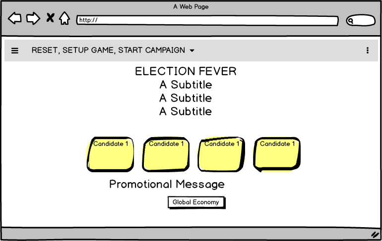
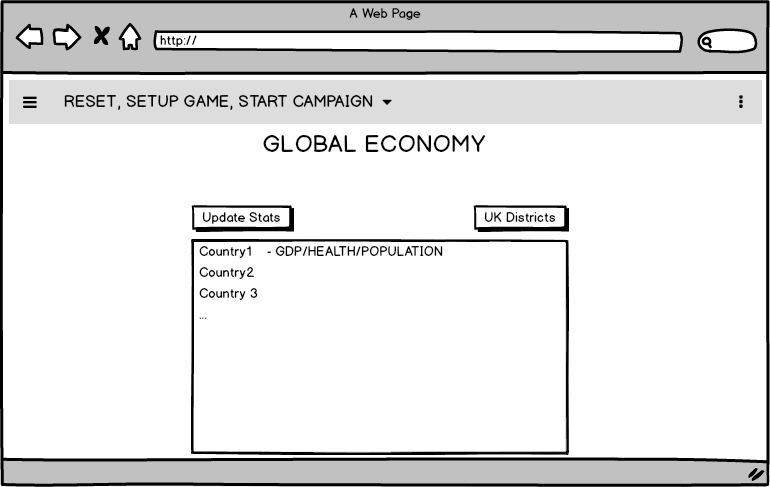
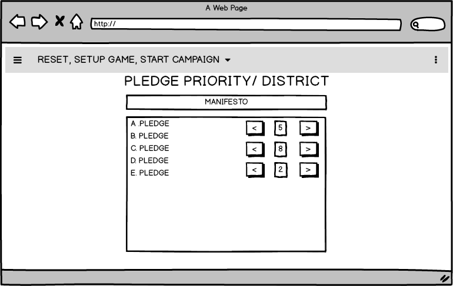
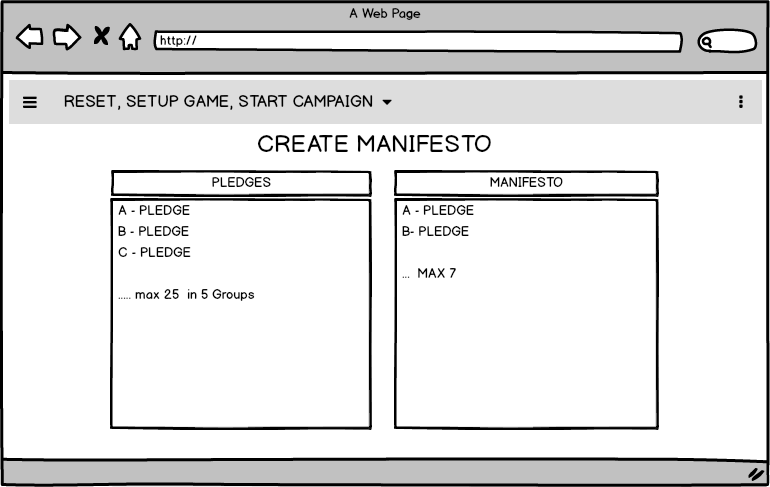
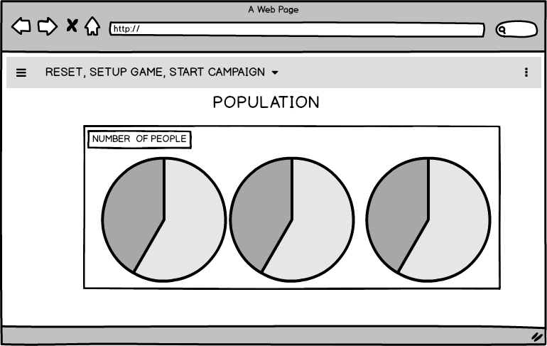
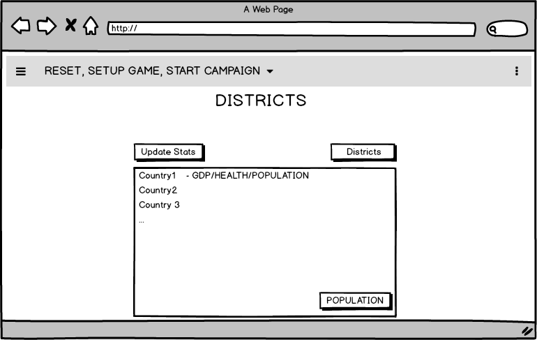
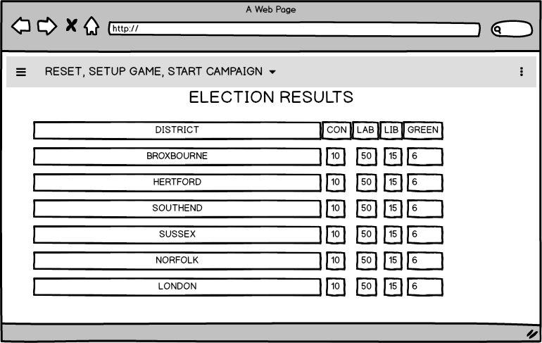
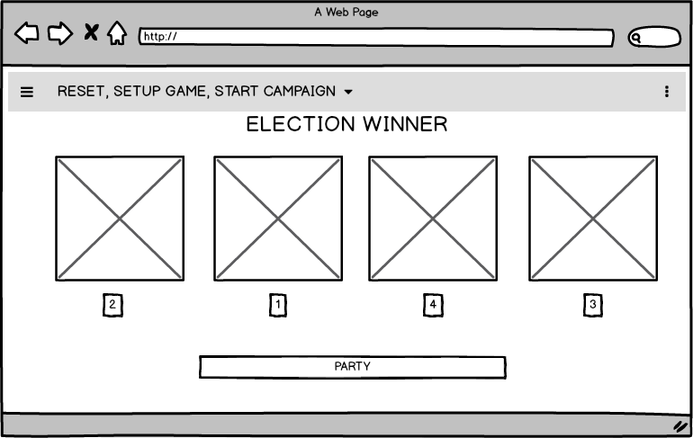
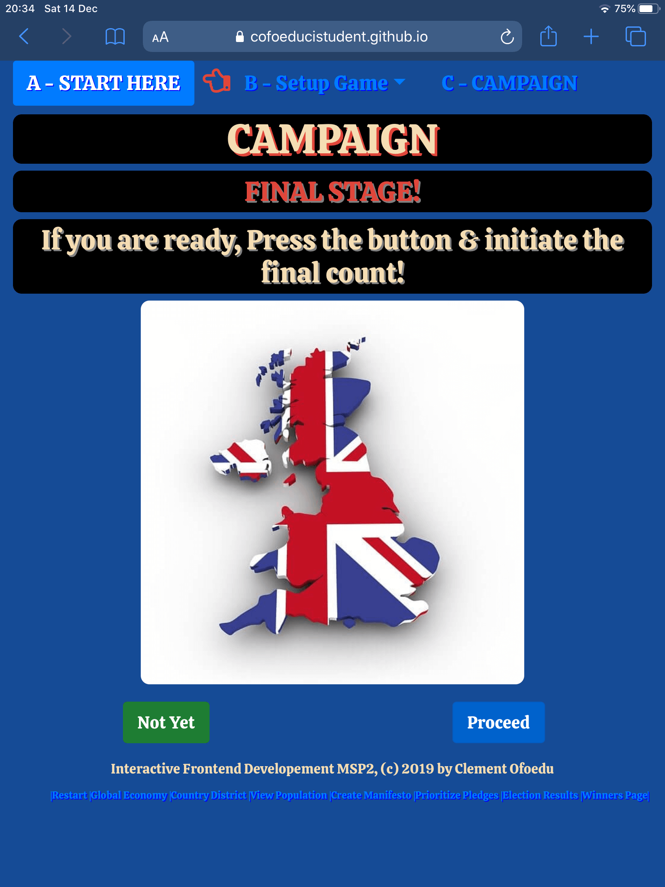

# IFDMSP-A

Interactive Frontend Development Milestone Project

[https://cofoeducistudent.github.io/IFDMSP-A/](https://cofoeducistudent.github.io/IFDMSP-A/)

># ** ELECTION FEVER **

## Milestone2 Project (MSP2)

> Disclaimer: The following Requirement (hypothetical)!
> # INDEX PAGE

[UX](#UX)

[1. Project Mandate](#Project-Mandate)

[2. Strategy](#Strategy)

[2.a Technologies Used](#Technologies-Used)

[3. Scope](#Scope)

[4. Structure](#Structure)

[5. Skeleton](#Skeleton)

[6. Surface](#Surface)

[7. Features](#Features)

[8. Existing Features](#Existing-Features)

[9. Features Left to Implement](#Features-Left-to-Implement)

[10. Testing](#Testing)

[11. Deployment](#Deployment)

[12. Credits](#Credits)

[13. Content](#Content)

[14. Media](#Media)

[15. Acknowledgements](#Acknowledgements)

[16. Game Instructions](#Game-Instructions)

># Project-Mandate!
BBC London has approached me for a website-based game.

* They wish for something that will tap into the current zeitgeist of the political process occurring as of late 2019, namely Brexit. Because Brexit is quite decisive and polarizing, they have stated that they want the game to merely focus on the political process of voting and avoid the real political topic of the EU exit referendum.

* Following a short meeting, I was given a small budget and asked to create a prototype of a potential game that would allow members of the public to try and understand what it feels like to be a politician during the electoral run. This they speculate would be interesting enough for a member of the public to give them a small, but somewhat limited taste of becoming one of the currently more disliked career opportunities in the public eye.

* The BBC has said they are exploring other avenues for something of entertainment value to fulfill their current need, and therefore they simply require something to put to their director of entertainment body in 10-15 days for a concept test.

* In addition, they have stated for legal reasons they do not wish that I utilize any names of real current politicians, as there are strict guidelines regarding the political process, and they wish to avoid anything that could be construed as potentially libelous.

* Also, they have said not to worry too much about performance, for if the game is selected for production, they will redesign with appropriate technologies conducive to large scale public consumption, similar to many other similar endeavors of which they are experienced in. They simply want to see a working prototype quickly.

-Fin

># #UX

Within the following section I will describe various elements and thoughts that went into my design for the project. I will follow the tried and trusted five stage design principles used in my working style, namely

* Strategy
* Scope
* Structure
* Skeleton
* Surface

In addition, I may include rough sketches. They may not be born into the final game but are included for completeness. The code was created quickly and leaves room for optimization I am sure. However, my focus was getting a working prototype available for review.

># Strategy

Following discussions with the BBC, I have decided to produce a game for them with the following characteristics.  

> The Game in a Nutshell!

* The game will be a simplified pastiche of the events of a political run for the office of prime minister, as the player will assume the role of an already established UK parliamentarian (MP).

* Therefore, the game will focus on the ‘General Election’, not the challenge of local ‘bi-elections’.

* Your job as the leader of your chosen political party shall be to offer advice to the local representative in the districts with regards to promoting your party’s overall manifesto within the electoral districts.

* Once you have carried out the rounds of campaigning (promoting your manifesto pledges in this instance) you can move on to the Election day and see how your party fared.

* The party with the largest majority of public support within a district, gains control of the district.

* The party with the most majority of district ownership will win the election. Thus, making you the next UK Prime minster.

* As stated, this is a very simplified game, and should be approached as fantasy like, rather than an outright simulation.

## External User Goal
BBC patrons would appreciate a small game that would allow them to partake in a small way a venture the electoral environment, and perhaps through it have a small but improved understanding of the challenges faced by the political class.

## Site Owner Goal
BBC wish to provide some fun interactive experience for its patrons in that they can join in the electoral process and
experience what its like to be a political representative in a small way. Its not supposed to be an accurate simulation rather a fun experience taking the edge of the 2019 EU/Brexit furor.

## My Initial Thoughts

I will utilize common off-the-shelf technologies (COTS), that is web-technologies to prototype the game.

* HTML
* jQuery
* CSS
* BootStrap
* JavaScript
* Google-fonts
* Font-awesome
* Jasmine Test Tool

For testing I will use the Jasmine tool for some elements. But because I will be working in Rapid Application Design (RAD) mode, my first go to testing support tool will be ‘google developer tools’.

Also, I believe in setting break/test points in the code, to view variables outputs. i.e. console. Logs. I find this quicker. However, when most functions are working, I will structure a jasmine test template for automated testing, for future modifications.

> Following are user stories to support the development:

## User Stories

Following are some 'User Stories' to support the development. These are not necessarily complete, as user
stories can vary dependent on how intricate you wish to present the specification.However this level of clarity is sufficient to progress the development.

## Three primary stakeholders will be involved with the application on deployment

* The BBC (Owner)
* The User (Members of the public accessing the application through the internet)
* Developer (Those responsible for enhancing or upgrading the applications features)

| As a | I wish for a | So that |
|------|--------------|---------|
|User |A Navigation Menu|I can navigate around the software|
|User |Politician Selector|So that I can select the party I wish to represent|
|User |New Game Button|So that I can reset the game at will|
|User |Global Economy Button|The game can generate Algorithm to play the game|
|User |View District Feature|So I can view District Information|
|User |View Population Feature|So I can view the population data inside the districts|
|User |Create Manifesto Feature|So I Can Create my  Party Manifesto|
|User |Pledge Prioritize Status Bar|So I can see at a quick glance how I prioritized my pledges in each district|
|User |Canvass Report|So I can see a rough indicator of the district issues|
|User |Residents Button|So I can view the resident details within a district|
|User|Pledges Button|So I can prioritize the pledges in my manifesto for the different districts|
|User|Newsflash snapshot|So I can see a snapshot of the district issues|
|User|Visual Status of District|So I can see a snapshot of the district information in a graphic form|
|User|Results Page|So I can see status reflecting political status before/conversions/after the election|
|User|Current political state button|So I can see the current political sway in the overall districts|
|User|Implementation Strategy Button|So I can see any conversion, as a result of my strategy|
|User|Post Election State|So I can view the changes of my electioneering in the various states|
|Owner|Application/Game|To give the public a feeling of the political arena in a fun way|
|Developer|Test Template|So I can catch Errors During Further Development|

># Technologies-Used

To create the web application I employed various Software Tools.

|Technology Used|Version|Reason for Use|Manufacturers-site-link|
|:--------------|:------|:-------------|:----------------------|
|HTML|5|Markup Language used to create the webpage in accord with the internet technologies|The latest HTML standard| integrated within many web-browsers
|CSS|3|To style the website|The latest CSS standard Integrated within HTML|
|Bootstrap4|4.1.3 *|Toolkit to help develop the website|https://getbootstrap.com|
|jQuery|3.3.1|Integrated as support to Bootstrap file via CDN|https://code.jquery.com/jquery-3.3.1.slim.min.js|
|popper|1.14.7|Integrated as support to Bootstrap file via CDN|https://cdnjs.cloudflare.com/ajax/libs/popper.js/1.14.7/umd/popper.min.|
|Javascript|4.3.1|Integrated as support to Bootstrap file via CDN|https://stackpath.bootstrapcdn.com/bootstrap/4.3.1/js/bootstrap.min.js|
|Just color picker|5.2.0|Grab color images from screen pixels|https://annystudio.com|
|Affinity Photo - software|1.7.3|Image manipulation|https://affinity.serif.com/en-gb/photo/|
|VS-Studio|1.38.1|Microsoft - IDE used to design the website|https://visualstudio.microsoft.com|
|Monosnap|3.62|Screen Grabber & Recorder- used to convert video clip of entity face repeat - ( Apple App Store)|https://monosnap.com|
|Chrome Browser|Version 77.0.3865.90 (Official Build) (64-bit)|To test website using Chrome-Tools|https://www.google.co.uk/chrome/?brand=CHBD&gclid=EAIaIQobChMI38eKkIuG5QIViaztCh2jWg5DEAAYASAAEgL6hfD_BwE&gclsrc=aw.ds|
|Git|2.23.0|Version Control|https://git-scm.com|
|Git-Hub|2.23.0|Git Cloud Repository Storage Facility|https://github.com|
|TinyJpg|n/a|Image compression/ Size reduction|https://tinyjpg.com/|
|HTML online Validator|n/a|Code Validation - To Validate the HTML code|https://validator.w3.org/#validate_by_input|
|CSS online Validator|n/a|Code Validation - To Validate the CSS code|https://jigsaw.w3.org/css-validator/#validate_by_input|
|Balsmiq|3|Wireframe-Mockup Software|https://balsamiq.com/wireframes/|
|CSS - Auto prefixer|n/a|Auto prefix CSS files for browser compatibility|https://autoprefixer.github.io/|
|Fontawesome|5.11.2|Icon supply for website|https://fontawesome.com/|
|Googlefonts|n/a|provide access to font family ("Exo")|https://fonts.google.com|
|MAMP|5.3|Webserver integrated package|https://www.mamp.info/en/|

># SCOPE

 The scope of the project will therefore be:

1. Create a web-based game, to allow members of the public to get a feel for some part of the political process, specifically the run for Prime Minister.

2. The game is a fantasy and not a simulation. Accuracy is not of concern. I.e. districts, population, issue will not be effectively rendered here.

3. The player will assume the role of an MP
4. The player will create and have responsibility for creating a political manifesto
5. The player will promote said manifesto
6. The player will enter a “General Election”
7. The player will see the results of their political strategy.

>|

In summary,

* I will not be concerned with optimization and performance as stated by the BBC, as they require a working prototype as quickly as possible, as they are soliciting other ideas simultaneously.

* If my game is selected it will be re-written with performance in mind, as the BBC is a global brand and has distributed server platforms serving many people.

* Although there are many facets potentially to such a game, my game will be simplified

* I will avoid the use of any real politician names, to avoid any legally libelous situations

* Finally, and most importantly the product is a game and not a simulation

Of importance in this work,  is the project "triple constraint" placed on the project by the BBC

1. Cost - 1
2. Schedule - 2
3. Quality - 3

## Outside of scope

* Performance improvements, especially with regards to technology

* Realistic accuracy of data (as this is a fun fantasy game)

* Any other items/feature not explicitly stated above

># Structure

The data required for the game will be primarily integrated into the JavaScript file, as opposed to the html file.

This will allow a somewhat more centralized data structure in the absence of a database.

There are a few important data elements that will be included, from the obvious to the not so obvious. Some of these are....

* Countries (indirectly related for data generation)
* Districts (fantasy Not accurate)
* Political Parties
* Politician data
* People (residents) of districts & there supporting data
* Score-data

Table 1.1

| Data | Content | Purpose |
|------|---------|---------|
| 1 | Global Countries Data | Used as part of an algorithm to generate values in code |
| 2 | Districts |Districts filled with residents to canvas for votes |
| 3 | Political Parties | Conservative / Labour / Lib-Dem / Green party |
| 4 | Politicians Data | Holds the data representing the politicians for the political parties|
| 5 | Populous Data | The data of the people in the various districts |
| 6 | Score Data | This refers to district relevant  data |
| 7 | Issues & Response Data | The data of randomly generated issues affecting the district & appropriate solution options|
| 8 | Images | Images of politicians head-shots|

># Skeleton

Before proceeding to build the application , I rendered some mockups. These did change slightly as development progressed. Most of the changes were realized as part of testing the app and realizing some additive was required

>## Note: The population view had a major revision later, as I decided it would be better if the player could see individual people names. Giving the player a somewhat more realistic view of the electioneering process.

># Surface

## Colour Scheme

* Because the application is supposed to be a game. I scoured retro gaming on google to asses typical color schemes. A lot of retro fun games had bright primary colors woven into its fabric. This was mainly due to limitation of graphics cards in early computer systems. However such colors were put to good use and calm colors were used for main spacial areas, and bright colors for stand out elements.

* Blue and green used mainly for calm.
* Red was used frequently for danger.
* Lastly, lots of flashing was used to denote action or activity. A quick visit to arcade machine would confirm this.

* I have decided to employ this approach to the game

## Aesthetics

I opted to use rounded borders for much of the layout. The curves promotes a softer visual aesthetic. My thinking here is that the game is supposed to be fun. I didn't wish straight edges as they frequently are related to logic and order and mathematically accurate things. My understanding is that the BBC wish their patrons(members of the public) to use the application. And they come from a wide variety of backgrounds. It is possible to alienate people from not even attempting to use the application, as they may believe it too logical and boring. Therefore a soft curved appeal with bright 'gamey' colors should appeal across the board. Indeed the blue color used I matched to 'Sonic the Hedgehog blue - by Sega"

># Features
For any application to be of use, it requires features. Verbose features are essentially input and output points for communicating with the application. In a way, some features are obvious and generalist, such as navigation. Others are more specific to the software.

Below are features I need for the application to function as needed. I expect them to be integrated into the application for the application to function and complete the requirements.

| Feature | Purpose |
|:---------|:--------|
| Navigation Menu | To navigate through sections of the game|
| Politician/Party Selector| Allows the player to select a politician representing a one of four political parties|
| New Game Button | Allows user to reset the game, through a reset screen |
| Global Economy | Feature that generates Three factors for 195 countries. These factors are used as control numbers and used within the game as part of a control algorithm|
| View District Feature | Allows the user to look at any of the districts and gauge its specific issues. The user will spend much of their time here assessing the different elements that are key to progressing in the game|
| View Population | Feature allows user to list the residents of the districts. They will be able to then determine the state of mind of the individual resident, prior to making decisions that will determine if they will successfully convert the said resident|
| Create Manifesto | Feature allows the user to create the political manifesto of their party from 25 pledges in 5 areas concern “Crime, Health, Wealth, Employment, Social Satisfaction”|
| Pledge Priority Status Bar | Shows the priorities assigned to each pledge in your manifesto / area|
| Canvass Report | Provides a guide to the social momentum in the area. This information is not to be wholly trusted, but used as a guide, in as-much as polls are in real elections. The truth is they can be wrong. For this reason, the user should open each district and review the populous data |
| Residents Button | Allows user to view a list of residents in a particular district|
| Pledges Button | Allows users to view the party manifesto and prioritize the pledges as wished |
| Newsflash | Provides snapshot of issues in district |
| Visual Status of District | Allows user to see a quick snapshot of issues. Again, this is not to be relied upon, as it was taken from the canvass report information |
| Results Page | Provides three bits of information on the pressing respective buttons |
| Pre-Election Stats |(A)-Current state of political support in the various districts |
| Implement Strategy |(B)-On applying your manifest, pledges and priorities, the people converted to your party during the election|
| Post-Election Stats |(C)-The political changes in support within the various districts after the election process |

> Note: I have not placed any social media ICONS on the application. My reasoning is that the application is expected to be hosted on the BBC website. Also the application was commissioned by them. Therefore the BBC do not appreciate links that may distract or move people off-site. Even if to another location owned by them. It disrupts reader/user flow,and there is a risk of loosing engagement.
># Existing-Features

* All as stated above

># Features-Left-to-Implement

* None: The BBC have specified that their objective is to create a prototype. However they have paced constraints on the project. These are schedule and cost. For this reason the features are locked to what I have specified above. Anything else is outside of scope.

* It is expected that prior to deploying the application in production , the application may be rewritten for performance optimization.

># Testing

### Much of my testing was carried out during development.

* I used the "google-dev-tools" to view elements and variables

* I also placed verbose console.log at various code points, to verify values

### I have also created a "Jasmine" test-script for production cycle future changes 

># Deployment

Clone the Git-hub site
To clone the repository (repo) simply

Install Git 2.23.0 on your local drive, and ensure it is working.

From my git-hub, copy the clone link found by clicking on the button below

Currently my application is hosted on GitHub Pages . However the software files can be hosted on a production server

Production Hosting
The file structure of the project is in a standard tree flow format.

Once your hosting site has been purchased and setup
Copy the contents of the IFDMSP-A folder into the root\public\ of the website host plan
delete the "SUPPORT" folder to remove the support files of this read  me.

Any hidden file/s & .gitignore can also be deleted
Ensure the correct rights are placed on your file structure especially read and execute only on key files.

Your admin should be able to help if you have an issue.
The file structure references are relative. Therefore no changes should be needed.

You should end up with the following files in \public directory.

* campaign.html
* country-district.html
* create-manifesto,html
* election-day.html
* generate-populous.html
* global-economics.html
* index.html
* pledge-priority.html
* README.md
* reset-game.html
* results-page.html
* winner-page.html

In addition Images within the Images Directory

* cara-leyton.png
* chris-wells.png
* christian-bell.png
* julie-greenwood.png
* julie-grey.png
* map-uk.jpg
* paul-moss.png
* vicky-morse,png

** Note **: The support folder holds the images to support this README.md. It is not required on a live site. Therefore it can be deleted on a production deployment. Also delete the .gitignore.

CAVEAT:!!
WARNING:Currently git-hub will only allow static sites to operate in their repositories. This means that form actions are blocked, and you will receive an error when using the contacts page. However if you clone the repo to your local machine running a web-server such as MAMP or XAMMP etc, or your own hosting plan, you will be able to see the validation form after submitting
CDN vs Local Stored Data
I built the site using CDN links. It is possible and may be preferred by some to download the source files for Bootstrap etc and internalize them within their file hosting service, however, my thoughts were as follows.

PROS: You gain resilience by having all that you need to make your site function on your servers

CONS: Your users will pull supporting reference files from your location.

CONS: Any internal code fixes can be controlled from the code distributors directly.Changes, however, may require a version number change. In that situation, all you do is change the ref link numbers.

Note: Content-Delivery-Network(CDN) are there for a reason. The data is stored at various centers globally. Therefore someone in the USA for example, accessing the site will benefit from the support files been pulled from a more regional location, and not across the other side of the world perhaps, where the original was stored. This approach is what is used in cloud technology to offer greater resilience and performance.

># Credits
I created all the code within this site. This is why its probably not as expertly done I'm sure
Most of the code was in Javascript, and not much Bootstrap was used. Where I needed help I used the help reads on W3schools web site. It wasn't easy, but I set myself this task so I could use javascript in anger. Which is the only way to learn.

I would like however to acknowledge Philip Feldman for the code snippet from Stack-Overflow site. As it was very useful.

>
/* Code from Stack-overflow - Philip Feldmann */
/* Keep text from overspilling out of columns */
.keep-insideBSol
{
    -moz-hyphens:auto;
    -ms-hyphens:auto;
    -webkit-hyphens:auto;
    hyphens:auto;
    word-wrap:break-word;
 }

># Media

The picture images used in this game were generated by me using a public available website.
They are in no way supposed to reflect any people living or otherwise.

To create face Avatar images
[Cartoonify](https://www.cartoonify.de/)

list of countries got from
[worldometers](https://www.worldometers.info/geography/alphabetical-list-of-countries/)

A nice imahgge of the united kingdom. royalty free comm/personal
[map of uk]
(https://publicdomainvectors.org/en/free-clipart/UK-and-Ireland/63389.html)

[list of counties England]
(https://en.wikipedia.org/wiki/Ceremonial_counties_of_England)

[Map of UK image]
(https://pixabay.com/illustrations/map-uk-flag-borders-country-1019896/)

Royalty free to use

[Pexels]
(https://www.pexels.com/royalty-free-images/)

># Acknowledgements

* I would like to acknowledge people from code-institute that helped and offered advice when I needed help.
1. Mentor - Narender Singh

* Disclaimer:
The characters and scenarios represented in this game are purely fantasy and for fun. No level of accuracy in relation to districts and economy are been implied by the information in this game. As stated above the project mandate was fictitious for the purpose of my MSP2, and not affiliated to the BBC organization in anyway.

#+++++++++++++++++++++++++++++
># Game Instructions
 
>## 1. LAUNCH GAME

>## 2. SELECT POLITICIAN

* This will align you to a party, also setting your party ribbon colour

>## 3. CREATE GLOBAL ECONOMY

* This will process 195 countries, randomly selects 3 from which it will derive value used in the election engine algorithm.

>## 4. REVIEW DISTRICTS

* Spend most of your time here!
* Do not take the presented data as totally accurate , they come from media polls (which we know in the fog of politics, can be frequently inaccurate). Rather view the "Residents" information directly to decide on your pledge approach.

* Create your "MANIFESTO" From 25 Available Pledges in 5 categories

* Enter "Pledges" screen & prioritize your pledges.
 
>## 5. CREATE MANIFESTO

* You must select 7 Pledges to create your manifesto.

>## 6. PRIORITIZE PLEDGES

* Prioritize your pledges per district.
* Options are L = Low focus /  M = Med focus /  H = High focus
* Note: Only two ('H') are available for use in each district. These essentially are your major focus and drive on a particular pledge message to the residents. Choose wisely!)

>## 7. ENTER CAMPAIGN

* Warning: Once you pass this stage you cannot go back and make any changes to your campaign!

>## 8. VIEW RESULTS

* On this page press the 3 buttons in sequence to view

1. The political state before election day
2. The effect of your political campaign
3. The changes post election day

>## TROUBLESHOOTING

*On occasion you may receive one of the following error messages below and sent to the main screen. Or you cannot progress to the "global-economy" or "Districts" page?  Please press the "NEW GAME" button and reset data to resolve.

### This is caused by session-data conflict , when the application detects partial data resident from a previous execution of the game

># END